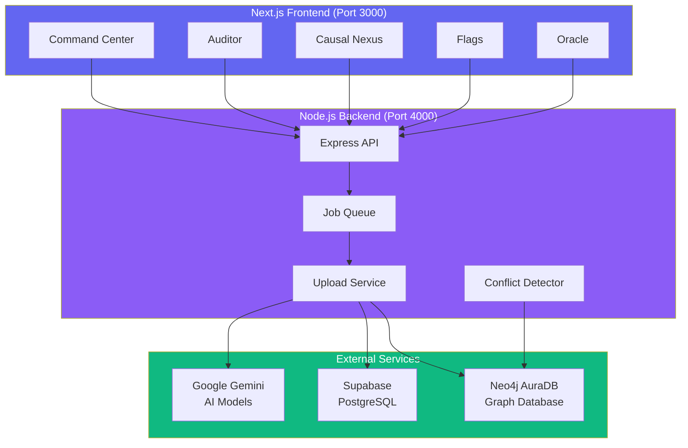

# Aletheia - Causal Memory Engine

**Enterprise-grade SaaS for institutional knowledge preservation and conflict detection.**

Aletheia is a production-ready Causal Memory Engine (CME) that ingests documents, extracts decisions using AI, stores them in a causal graph, and detects conflicts in institutional knowledge.

---

## 🏗️ Architecture



---

## ✨ Features

### Command Center
- **Consistency Score**: Live metric (0-100) based on conflict detection
- **RED/GREEN/NEUTRAL Counters**: Visual health dashboard
- **Real-time Updates**: Metrics refresh every 10 seconds

### Auditor
- **Non-blocking Upload**: Files queued via job system (no API blocking)
- **Progress Tracking**: Real-time job status polling
- **Duplicate Detection**: SHA-256 hash check before processing

### Causal Nexus
- **Interactive Graph**: React Flow visualization
- **Color-coded Nodes**: RED (conflict), GREEN (alignment), NEUTRAL (independent)
- **Relationship Types**: CAUSES, BLOCKS, DEPENDS_ON

### Flags
- **Conflict Audit Stream**: All detected conflicts with severity ratings
- **Path Visualization**: Shows decision chains causing conflicts

### Oracle
- **Retrieval-Only Responses**: Every answer cites Decision IDs
- **No Hallucination**: If no verified decision exists → "No verified decision found"
- **Citation Enforcement**: Powered by RAG (Retrieval-Augmented Generation)

---

## 🚀 Quick Start

### Prerequisites
- Node.js 20+
- Docker & Docker Compose
- Accounts for:
  - [Supabase](https://supabase.com) (PostgreSQL)
  - [Neo4j AuraDB](https://neo4j.com/cloud/aura/) (Graph Database)
  - [Google AI Studio](https://aistudio.google.com/app/apikey) (Gemini API)

### Installation

1. **Clone the repository**
   ```bash
   git clone <your-repo-url>
   cd Aletheia
   ```

2. **Configure environment**
   ```bash
   cp .env.template .env
   ```
   
   Edit `.env` and fill in ALL required values:
   - Supabase URL and Key
   - Neo4j URI, User, Password
   - Gemini API Key

3. **Start with Docker**
   ```bash
   docker-compose up --build
   ```

4. **Access the application**
   - Frontend: http://localhost:3000
   - Backend API: http://localhost:4000
   - Health Check: http://localhost:4000/health

---

## 📁 Project Structure

```
Aletheia/
├── backend/                 # Node.js Express API
│   ├── src/
│   │   ├── config/         # Environment validation
│   │   ├── services/       # Supabase, Neo4j, Gemini, Job Queue
│   │   ├── routes/         # API endpoints
│   │   ├── types/          # TypeScript interfaces
│   │   └── server.ts       # Express server
│   ├── Dockerfile
│   └── package.json
│
├── frontend/                # Next.js 14 App
│   ├── src/
│   │   ├── app/            # Pages (Command Center, Auditor, etc.)
│   │   ├── components/     # Reusable UI components
│   │   └── lib/            # API client
│   ├── Dockerfile
│   └── package.json
│
├── docker-compose.yml       # Orchestration
├── .env.template            # Environment variables template
├── .gitignore               # CRITICAL: Ensures .env is never committed
└── README.md
```

---

## 🔐 Security

✅ **Environment Variables**: All secrets loaded from `process.env`
✅ **Fail-Fast Validation**: Server won't start if required env vars are missing
✅ **No Hardcoded Secrets**: `.env` is gitignored
✅ **Docker Security**: Non-root users in containers

---

## 🔌 API Documentation

### Upload Endpoints
- **POST `/api/upload`** - Upload file for processing
  - Returns: `{ job_id }` (non-blocking)
- **GET `/api/upload/:jobId/status`** - Poll job progress
  - Returns: `{ status, progress, ... }`

### Decision Endpoints
- **GET `/api/decisions`** - Get all decisions (paginated)
- **GET `/api/graph`** - Get graph data for visualization

### Metrics Endpoints
- **GET `/api/metrics`** - Get consistency score and counters
- **GET `/api/flags`** - Get all conflict flags

### Oracle Endpoint
- **POST `/api/oracle/query`** - Ask questions
  - Body: `{ question: string }`
  - Returns: `{ answer, citations }` or `{ error }`

---

## 🎯 CME Decision Schema

Every decision stored includes:

```json
{
  "decision_id": "sha256_hash",
  "schema_version": "v1",
  "source_type": "video | slack | github | document",
  "source_ref": "timestamp_or_url",
  "actor": "person_or_team",
  "decision": "what was decided",
  "reasoning": "why",
  "constraints": ["list"],
  "sentiment": "RED | GREEN | NEUTRAL",
  "precedents": ["decision_id"],
  "timestamp": "ISO8601"
}
```

**Schema Versioning**: The `schema_version` field ensures backward compatibility as the system evolves.

---

## 📊 Consistency Score Formula

```
Consistency Score = 100 - (RED flags × 10) - (Unresolved conflicts × 5)
```

- **100%** = Perfect consistency
- **0%** = Maximum conflicts
- **Weight configurable** per organization needs

This transparent formula demonstrates enterprise maturity.

---

## 🛠️ Development Workflow

### Backend Development
```bash
cd backend
npm install
npm run dev  # Runs on port 4000
```

### Frontend Development
```bash
cd frontend
npm install
npm run dev  # Runs on port 3000
```

### Building for Production
```bash
docker-compose build
docker-compose up
```

---

## 🧪 Testing

### Manual Verification Checklist
1. ✅ Upload a text file in Auditor
2. ✅ Verify job status updates (queued → processing → completed)
3. ✅ Check Command Center for updated metrics
4. ✅ View decisions in Causal Nexus graph
5. ✅ Ask Oracle a question and verify citations
6. ✅ Check Flags page for any conflicts

---

## 🎨 UI Design Philosophy

**Glassmorphism**: Modern, premium aesthetic with:
- Backdrop blur effects
- Layered depth
- Vibrant gradients
- Smooth micro-animations

**Color Palette**:
- 🔴 RED: `#ef4444` (Conflicts)
- 🟢 GREEN: `#10b981` (Alignments)
- ⚪ NEUTRAL: `#6b7280` (Independent)
- 🔵 PRIMARY: `#6366f1` (Accents)

---

## 🚢 Deployment

### Docker Production
```bash
docker-compose -f docker-compose.yml up -d
```

### Environment Variables (Production)
Ensure ALL required variables are set:
- Supabase credentials
- Neo4j credentials
- Gemini API key
- Frontend URL (for CORS)

---

## 📖 Enterprise Improvements

This system includes four production-grade architectural decisions:

1. **Job Queue Abstraction** - Non-blocking uploads with swappable backend (in-memory → BullMQ)
2. **Schema Versioning** - `schema_version: "v1"` for safe evolution
3. **Retrieval-Only Oracle** - Citation-enforced responses (no hallucination)
4. **Consistency Score Formula** - Clear, explainable metric for stakeholders

See [`enterprise_improvements.md`](./.gemini/antigravity/brain/.../enterprise_improvements.md) for details.

---

## 📝 License

MIT

---

## 🤝 Contributing

Contributions welcome! Please:
1. Fork the repository
2. Create a feature branch
3. Submit a pull request

---

## 📞 Support

For enterprise support or questions, please open an issue.

---

**Built with ❤️ for teams who value institutional knowledge**
